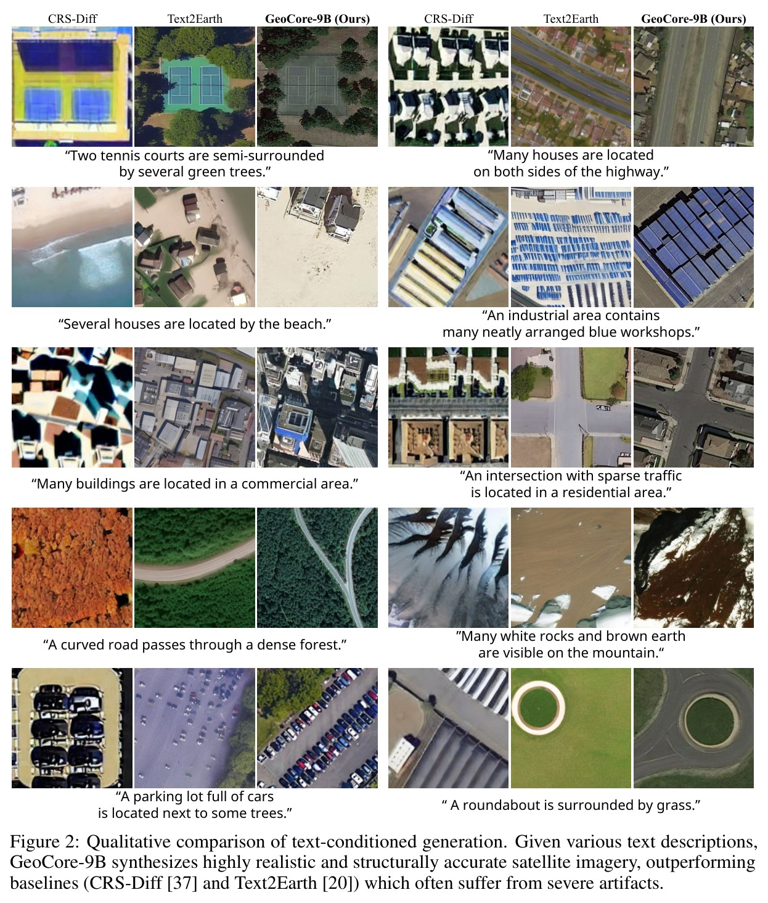
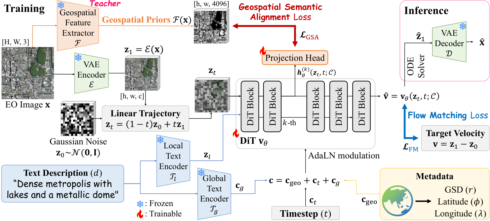

<div align="center">


# GeoCore-9B: Towards Geo-Aware Generative Foundation Models in Earth Observation

[Jeonghyeok Do](https://jeonghyeokdo.github.io/) &nbsp;·&nbsp;
[Munchurl Kim](https://scholar.google.com/citations?user=bGXte_4AAAAJ&hl=en)

Korea Advanced Institute of Science and Technology (KAIST)

[](https://kaist-viclab.github.io/GeoCore-9B_site/static/assets/GeoCore-9B-paper.pdf)
[](https://kaist-viclab.github.io/GeoCore-9B_site/)
[](https://huggingface.co/JeonghyeokDo/GeoCore-9B)
[](LICENSE)




</div>

Official implementation of **GeoCore-9B**, a 9.24-billion-parameter Flow Matching DiT for RGB
Earth Observation (EO) generation. Its DiT backbone is trained from scratch on Git-10M rather than
initialized from a natural-image diffusion model; the VAE and text encoders are frozen pre-trained
components.

---

## 📰 News

- **Aug 2026:** Paper, code, pretrained weights, and project page released. 🎉

---

## Overview

GeoCore-9B natively conditions generation on text descriptions, a zoom-derived resolution
(nominal-GSD) index, latitude, and longitude. Unlike EO generators initialized from natural-image
diffusion models, its DiT backbone is trained from scratch on the global-scale
[Git-10M](https://huggingface.co/datasets/lcybuaa/Git-10M) corpus. This avoids initialization from
natural-image diffusion-generator weights while retaining frozen pre-trained components for
autoencoding and text conditioning.

| | |
|---|---|
| Parameters | 9.24 B |
| Backbone | Flow Matching DiT (8 double-stream + 24 single-stream blocks, hidden 4096, 32 heads) |
| Conditioning | CLIP + T5 text embeddings, GSD, latitude, longitude |
| Pre-training | 300K steps, Git-10M, global batch 1024, AdamW lr 1e-4, bf16, DeepSpeed ZeRO-2 |
| Hardware | 8x NVIDIA B200, ~15 days |

<p align="center">
  
</p>

### Geospatial Semantic Alignment (GSA)

Training a 9B DiT from scratch on EO data converges slowly and produces spatially unstable samples.
GSA is a **training-only** feature alignment objective: intermediate DiT tokens at block `k = 8` are
projected into the feature space of a frozen [DINOv3-Sat](https://github.com/facebookresearch/dinov3)
teacher and aligned with its dense structural representations.

```
L_total = L_FlowMatching + mu * L_GSA        (mu = 0.5)
```

The frozen teacher is required only during GSA training and is not loaded for sampling. The released
checkpoint retains the projection head for compatibility, and the current model forward executes it
during sampling; the reference code therefore guarantees teacher-free inference, not zero
projection-head overhead. In this codebase GSA appears as:

| Component | Location |
|---|---|
| Projection head `W_proj` | `REPAEmbedder` in [`models/flux2.py`](models/flux2.py) |
| Alignment block `k = 8` | `depth_repa` field on the `*Params` dataclasses |
| Alignment loss | `SILoss_Flux2.proj_loss` in [`loss.py`](loss.py) |
| Frozen teacher | `load_encoders` in [`utils.py`](utils.py) (`--enc-type dinov3-vit-7b`) |
| Weight `mu` | `--proj-coeff 0.5` |

`SILoss_Flux2_no_repa` in [`loss.py`](loss.py) is the GSA-free variant used for LoRA adaptation.
Progressive full fine-tuning in [`finetune.py`](finetune.py) retains GSA supervision and the frozen
DINOv3-Sat teacher.

### Metadata conditioning

The zoom-derived resolution index `r` (a nominal-GSD proxy), latitude `phi`, and longitude
`lambda` are each encoded as 256-dimensional sinusoidal features and projected by separate MLP
embedders. Their sum is added to the timestep embedding and
the pooled text embedding to form the global conditioning vector that modulates the DiT through
AdaLN. See `Flux2.make_vec` in [`models/flux2.py`](models/flux2.py).

Missing conditional metadata is not simply zeroed: the model holds **learnable null embeddings**
(`null_res_emb`, `null_lon_emb`, `null_lat_emb`) that substitute for absent fields. Passing
`-999.0` selects the corresponding null embedding, and `CFGDataset` uses this behavior for
conditioning dropout during training. In the current reference sampler, the separate unconditional
CFG branch supplies zero-valued metadata rather than `-999.0`.

**Resolution convention.** The `res` conditioning value is the zoom-derived resolution index
`17 - z`, where `z` is the Google XYZ tile zoom level. Thus, `res = 0` corresponds to a nominal
equatorial GSD of roughly 1.2 m/px and each `+1` doubles that proxy (`res = 5` is roughly
38 m/px). Images upscaled during preprocessing have
`log2(scale_factor)` subtracted. This is computed in `Git10MDataset.__getitem__`.

### Preprocessing and data

Git-10M is consumed in HuggingFace `datasets` format. Preprocessing lives in
[`data/dataset.py`](data/dataset.py):

* `XYZToLonLat` converts a Google `z_x_y` tile id to longitude/latitude, and `17 - z` to the GSD index.
* `process_image` resizes so the short side reaches 256 px (only when needed), random-crops to
  256x256, and normalizes to `[-1, 1]`.
* `CFGDataset` applies per-field conditioning dropout for classifier-free guidance.
* [`data/dataset_finetune.py`](data/dataset_finetune.py) additionally filters on
  `img_quality_score >= 4.8` for the progressive refinement stage.

---

## Paper results after adaptation

These values are reported after task-specific LoRA adaptation with the 9B backbone frozen; they are
not zero-shot scores from the released base checkpoint.

### RSICD text-to-image

| Method | IS ↑ | FID ↓ | CLIP ↑ |
|---|---:|---:|---:|
| CRS-Diff | 18.39 | 50.72 | 20.33 |
| Text2Earth | — | 24.49 | 25.62 |
| **GeoCore-9B (Ours)** | **22.15** | **18.82** | **27.15** |

### Practical downstream adaptation

| Task | Dataset | Reported metrics |
|---|---|---|
| Cloud removal | Sen2-MTC | 20.809 PSNR / 0.799 SSIM / 0.256 LPIPS |
| SAR-to-optical translation | QXS-SAROPT | 12.05 FID / 0.377 LPIPS / 0.0163 HF-SCC / 0.370 SSIM |

HF-SCC is the corrected, baseline-consistent high-pass spatial correlation coefficient used in the
matched comparison.

<details>
<summary><b>Matched 9B ablation of GSA</b></summary>

- RSICD FID: **28.43 → 18.82** (−9.61).
- QXS-SAROPT FID: **19.92 → 12.05** (−7.87).
- Sen2-MTC PSNR: **19.553 → 20.809 dB** (+1.256 dB).

All settings other than the pre-training GSA weight are held fixed.

</details>

See the [paper](https://kaist-viclab.github.io/GeoCore-9B_site/static/assets/GeoCore-9B-paper.pdf)
and [project page](https://kaist-viclab.github.io/GeoCore-9B_site/) for full comparisons,
qualitative results, metadata interventions, and limitations.

The public repository provides a generic image-conditioned LoRA training hook. Task-specific
Sen2-MTC/QXS-SAROPT dataset loaders, conditioned inference and evaluation scripts, and the exact
downstream experiment configurations are not included in this release.

---

## Installation

```bash
git clone https://github.com/KAIST-VICLab/GeoCore-9B.git
cd GeoCore-9B
pip install -r requirements.txt
```

### External assets

None of the following are redistributed here; download them from their original sources and respect
their licenses.

| Asset | Needed for | Source | License |
|---|---|---|---|
| Git-10M dataset | pre-training, fine-tuning | [`lcybuaa/Git-10M`](https://huggingface.co/datasets/lcybuaa/Git-10M) | CC BY-NC-ND 4.0 |
| DINOv3-Sat ViT-7B/16 (`sat493m`) | GSA pre-training only | [facebookresearch/dinov3](https://github.com/facebookresearch/dinov3) | DINOv3 License |

The frozen Flux.2 VAE, which everything needs, ships **with the weights**: `vae/` in
[`JeonghyeokDo/GeoCore-9B`](https://huggingface.co/JeonghyeokDo/GeoCore-9B/tree/main/vae). CLIP and
T5 text encoders are pulled from the HuggingFace Hub at runtime.

```bash
export DATA_DIR=/path/to/Git-10M/train
export VAE_DIR=/path/to/GeoCore-9B/vae      # ships with the released weights
export DINOV3_REPO=/path/to/dinov3          # local DINOv3 clone
```

#### Which copy of the FLUX.2 VAE

Black Forest Labs publishes this autoencoder twice. The copy inside
[`FLUX.2-klein-base-4B`](https://huggingface.co/black-forest-labs/FLUX.2-klein-base-4B) is
**Apache-2.0 and ungated**; the `ae.safetensors` of `FLUX.2-dev` holds the same weights under the
FLUX Non-Commercial License v2.1, whose §4(a)(iii) forbids *"surveillance purposes, including all
research and development related to surveillance"* — not a clause an Earth-observation model should
ask its users to reason about. GeoCore-9B therefore standardises on the Apache-2.0 copy, and the
whole pipeline is usable under Apache-2.0.

Because that copy is Apache-2.0, it is redistributed unmodified inside the GeoCore-9B weight
repository (`vae/diffusion_pytorch_model.safetensors`, sha256 `ca70d220…`, byte-identical to
upstream, with the license text as `LICENSE-FLUX2-VAE.md`), so a single `snapshot_download` gives
you everything. Fetching it from Black Forest Labs directly works just as well:

```bash
huggingface-cli download black-forest-labs/FLUX.2-klein-base-4B \
    vae/diffusion_pytorch_model.safetensors --local-dir /path/to/FLUX.2-klein-base-4B
```

The two files differ only in serialisation: key names (diffusers vs BFL), dtype
(bf16 vs fp32), and eight attention projections stored as `(512, 512)` linears
rather than `(512, 512, 1, 1)` 1×1 convolutions. `load_vae_state_dict` in
[`models/vae_flux2.py`](models/vae_flux2.py) accepts either layout — and a file or a directory — so
`--vae-dir` takes the shipped `vae/` folder or the Klein-4B file directly, with no conversion step.
The rename rules were derived by pairing the two files tensor-by-tensor **on
value** rather than by assuming the naming convention: 250 of 251 tensors pair
one-to-one with a worst absolute deviation of `7.802e-03` (bf16 rounding of the
source file), and the one that does not is `bn.num_batches_tracked`, a BatchNorm
step counter the frozen codec never reads. Cast to bf16 — how `train.py` and
`inference.py` run the VAE — the two files give **bit-identical** latents and
reconstructions; in fp32 they differ by at most `6.0e-02` in the latent and
`2.3e-02` in the decoded image (range `[-1, 1]`), with round-trip PSNR
36.3961 dB against 36.4056 dB on the same crops.

The current DINO loader passes
`dinov3_vit7b16_pretrain_sat493m-a6675841.pth` as a relative checkpoint filename; make sure that
filename is resolvable by the local DINOv3 hub entrypoint, or update [`utils.py`](utils.py) to pass
its absolute path.

---

## Usage

### Pre-training (with GSA)

```bash
bash scripts/train_pretrain.sh
```

Launches the paper configuration: 300K steps, global batch 1024, `--proj-coeff 0.5`, and ZeRO-2
across 8 GPUs via [`configs/zero2_8gpu.yaml`](configs/zero2_8gpu.yaml). The exact hyperparameters
are recorded in [`configs/pretrain_geocore9b.json`](configs/pretrain_geocore9b.json).

### Full fine-tuning (progressive refinement)

```bash
BASE_CKPT=/path/to/0300000.pt bash scripts/train_finetune.sh
```

Continues training on the `img_quality_score >= 4.8` subset of Git-10M while retaining GSA
supervision; the DINOv3-Sat teacher is therefore still required.

### LoRA fine-tuning

```bash
BASE_CKPT=/path/to/0300000.pt bash scripts/train_lora.sh
```

Freezes the backbone and trains LoRA adapters (`r = 64`, `alpha = 128`) on the `qkv`, `proj`,
`linear1` and `linear2` projections.

For **image-conditioned** downstream tasks such as cloud removal or SAR-to-optical translation, pass
`--cond-image`. This widens `img_in` with zero-initialised channels so a conditioning latent can be
channel-concatenated onto the noised input — the expanded model starts out identical to the
pre-trained one. You supply the paired dataset:

```bash
python finetune_lora.py --exp-name cloud-removal \
    --base-ckpt /path/to/0300000.pt --vae-dir "$VAE_DIR" \
    --data-dir /path/to/pairs \
    --cond-image --dataset-class my_pkg.my_module:MyPairedDataset
```

The class is constructed as `MyPairedDataset(data_dir)` and each item must be
`(cond_img, target_img, caption, meta)`, where `cond_img` and `target_img` are `[3, H, W]` tensors in
`[-1, 1]` and `meta` is a dict with float tensors `res`, `lon`, `lat` (use `-999.0` when unknown).
Checkpoints save the LoRA adapter plus `img_in_weight.pt`, since `img_in` is trained outside LoRA.
The standalone [`inference.py`](inference.py) does not currently accept a conditioning image or
restore the expanded `img_in_weight.pt`; conditioned downstream inference requires a task-specific
wrapper that is not included here.

### Inference

```bash
python inference.py \
    --ckpt /path/to/GeoCore-9B --vae "$VAE_DIR" \
    --prompt "A satellite view of a highly dense urban city with towering skyscrapers" \
    --lon 126.97 --lat 37.56 --res 0.0 \
    --num-samples 4 --out samples/
```

Omit any of `--res`, `--lon`, `--lat` to generate without that condition (the learned null embedding
is used instead). Add `--lora /path/to/lora_adapter` to merge a standard text-to-image adapter
before sampling. Image-conditioned adapters require the separate conditioned inference path noted
above.
`--ckpt` accepts a training `.pt`, a converted `.safetensors` file, or a sharded directory.

### Frozen probes

Linear probes on frozen DiT features, following the fixed protocol implemented in
[`eval/frozen_probe.py`](eval/frozen_probe.py): `z_tau = (1 - tau) z_0 + tau * eps` with `tau = 0.25`,
one forward pass with empty text and null metadata, features hooked at global blocks
`{4, 8, 16, 24}` (block 8 is the GSA-aligned one).

```bash
python eval/frozen_probe.py --task eurosat \
    --ckpt /path/to/0300000.pt --vae-dir "$VAE_DIR" \
    --data-root /path/to/downstream_datasets --gpu 0
```

Tasks: `loveda` (7-class segmentation, mIoU), `eurosat` (10-class classification, top-1), `bright`
(siamese building-damage change detection, mIoU). `--data-root` must contain `LoveDA/`,
`EuroSAT_RGB/` and `BRIGHT/`. The current probe script requires the original training `.pt`
checkpoint and does not accept the released sharded safetensors directly.

### Metrics

[`eval/metrics.py`](eval/metrics.py) provides batched PSNR / SSIM (3-D Gaussian) / LPIPS for
validation and downstream evaluation.

---

## Pre-trained weights

The released weights (the final 300K-step training state) are available as sharded bf16
safetensors on [Hugging Face](https://huggingface.co/JeonghyeokDo/GeoCore-9B). The reference
[`inference.py`](inference.py) accepts this sharded directory. At present,
[`finetune.py`](finetune.py), [`finetune_lora.py`](finetune_lora.py), and
[`eval/frozen_probe.py`](eval/frozen_probe.py) require the original training `.pt` checkpoint,
which is not part of the public Hugging Face release.

Convert the training checkpoint into sharded bf16 safetensors for the Hub. The training `.pt`
bundles the DeepSpeed ZeRO-2 optimizer state (~65 GB); the export keeps only the model weights
(~18.5 GB). The published GeoCore-9B weights are the final 300K-step training state: the EMA of
that run never accumulated due to a key-prefix bug in `update_ema` (fixed — see GitHub issue #2),
and the converter now refuses to export a state dict whose zero-initialized layers are still zero.

```bash
python scripts/convert_checkpoint.py \
    --ckpt exps/GeoCore-9B/checkpoints/0300000.pt \
    --out huggingface/ --weights model --dtype bf16
```

Loading the exported weights:

```python
import torch
from models.flux2 import Flux2, GeoCore9BParams
from inference import load_state_dict

model = Flux2(GeoCore9BParams()).to("cuda", torch.bfloat16)
model.load_state_dict(load_state_dict("path/to/huggingface"), strict=True)
model.eval()
```

The reference inference script loads the 9.24B DiT, T5-XXL, CLIP-L/14, and the VAE onto one device.
Their bf16 parameters alone require more than approximately 41 GB before activation memory; the
current script does not provide CPU offloading or a supported 24 GB single-GPU path.

---

## Repository layout

```
train.py               pre-training with GSA
finetune.py            full fine-tuning on the high-quality subset
finetune_lora.py       LoRA adaptation (text-to-image or image-conditioned)
inference.py           text + geospatial conditioned sampling
loss.py                flow matching objective, with and without GSA
samplers.py            Euler / Euler-Maruyama flow matching samplers
utils.py               DINOv3-Sat teacher loading
models/flux2.py        DiT backbone, metadata conditioning, GSA head
models/vae_flux2.py    Flux.2 autoencoder, diffusers/BFL checkpoint loading
models/text_encoder.py CLIP + T5 text encoders
data/                  Git-10M dataset, metadata extraction, CFG dropout
eval/                  frozen linear probes, image quality metrics
configs/               ZeRO-2 accelerate config, pre-training hyperparameters
scripts/               launch scripts and checkpoint conversion
```

---

## Citation

```bibtex
@article{do2026geocore,
  title   = {GeoCore-9B: Towards Geo-Aware Generative Foundation Models in Earth Observation},
  author  = {Do, Jeonghyeok and Kim, Munchurl},
  year    = {2026},
  url     = {https://kaist-viclab.github.io/GeoCore-9B_site/}
}
```

## Acknowledgements

The transformer and autoencoder in [`models/`](models/) are adapted from the
[FLUX.2 reference implementation](https://github.com/black-forest-labs/flux2) by Black Forest Labs
(Apache-2.0). GSA builds on representation alignment for diffusion training, and the frozen
teacher is [DINOv3-Sat](https://github.com/facebookresearch/dinov3). Pre-training uses the
[Git-10M](https://huggingface.co/datasets/lcybuaa/Git-10M) dataset from Text2Earth.

This work was supported in part by the National Research Foundation of Korea (NRF) grant funded by the Korean government (MSIT) under the Sejong Science Fellowship Program (RS-2026-25484549) for the project "Visualizing the Invisible Earth: A Reliability-Aware All-in-One SAR Analysis Framework with Foundation Models," and in part by the "Advanced GPU Utilization Support Program" funded by the Government of the Republic of Korea (Ministry of Science and ICT).


This work was supported by the National Research Foundation of Korea (NRF) grant funded by the
Korean government (MSIT) under the Sejong Science Fellowship Program (RS-2026-25484549), for
the project “Visualizing the Invisible Earth: A Reliability-Aware All-in-One SAR Analysis Framework
with Foundation Models.”

## License

Code is released under the [Apache License 2.0](LICENSE); see [NOTICE](NOTICE) for attribution of
adapted third-party code. The released GeoCore-9B weights are also Apache-2.0: the DiT is trained
from scratch on Git-10M and is not derived from any FLUX checkpoint.

The frozen Flux.2 VAE is the **Apache-2.0** copy from
[`FLUX.2-klein-base-4B`](https://huggingface.co/black-forest-labs/FLUX.2-klein-base-4B), copyright
Black Forest Labs, redistributed unmodified alongside the GeoCore-9B weights on the Hub under that
license (see `LICENSE-FLUX2-VAE.md` there). The identical weights distributed in `FLUX.2-dev` are
**not** used, because the FLUX Non-Commercial License v2.1 §4(a)(iii) forbids research and
development related to surveillance. Black Forest Labs neither endorses nor is affiliated with
GeoCore-9B.

The Git-10M dataset and the DINOv3-Sat teacher weights are not redistributed here and are governed
by their own licenses; Git-10M is CC BY-NC-ND 4.0 and therefore restricts (re)training to
non-commercial use.
